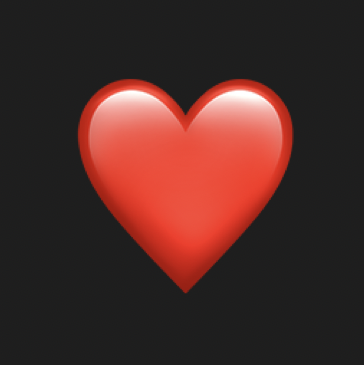
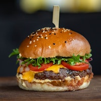

<!DOCTYPE html>
<html>

<head>
    <link rel="preconnect" href="https://fonts.gstatic.com">
    <link href="https://fonts.googleapis.com/css2?family=Space+Mono&display=swap" rel="stylesheet">
    <link rel="stylesheet" href="https://maxcdn.bootstrapcdn.com/bootstrap/3.3.5/css/bootstrap.min.css">
    <link rel="stylesheet" href="https://maxcdn.bootstrapcdn.com/font-awesome/4.4.0/css/font-awesome.min.css">
    <link rel="stylesheet" type="text/css" href="style.css">
    <title>Heading Out</title>
</head>

<body>
    

        

            
Heading Out

            

                

                    
                    
Melissa

                    <!--                     
melissa39@gmail.com
 -->
                

                

                    

                        <svg xmlns="http://www.w3.org/2000/svg" viewBox="0 0 14 14" fill="currentColor">
                            <path d="M13.533 5.6h-.961a.894.894 0 01-.834-.57.906.906 0 01.197-.985l.675-.675a.466.466 0 000-.66l-1.32-1.32a.466.466 0 00-.66 0l-.676.677a.9.9 0 01-.994.191.906.906 0 01-.56-.837V.467A.467.467 0 007.933 0H6.067A.467.467 0 005.6.467v.961c0 .35-.199.68-.57.834a.902.902 0 01-.983-.195L3.37 1.39a.466.466 0 00-.66 0L1.39 2.71a.466.466 0 000 .66l.675.675c.25.25.343.63.193.995a.902.902 0 01-.834.56H.467A.467.467 0 000 6.067v1.866c0 .258.21.467.467.467h.961c.35 0 .683.202.834.57a.904.904 0 01-.197.984l-.675.676a.466.466 0 000 .66l1.32 1.32a.466.466 0 00.66 0l.68-.68a.894.894 0 01.994-.187.897.897 0 01.556.829v.961c0 .258.21.467.467.467h1.866c.258 0 .467-.21.467-.467v-.961c0-.35.202-.683.57-.834a.904.904 0 01.984.197l.676.675a.466.466 0 00.66 0l1.32-1.32a.466.466 0 000-.66l-.68-.68a.894.894 0 01-.187-.994.897.897 0 01.829-.556h.961c.258 0 .467-.21.467-.467V6.067a.467.467 0 00-.467-.467zM7 9.333C5.713 9.333 4.667 8.287 4.667 7S5.713 4.667 7 4.667 9.333 5.713 9.333 7 8.287 9.333 7 9.333z" /></svg>
                    

                    

                        <svg xmlns="http://www.w3.org/2000/svg" viewBox="0 0 512 512" fill="currentColor">
                            <path d="M10.688 95.156C80.958 154.667 204.26 259.365 240.5 292.01c4.865 4.406 10.083 6.646 15.5 6.646 5.406 0 10.615-2.219 15.469-6.604 36.271-32.677 159.573-137.385 229.844-196.896 4.375-3.698 5.042-10.198 1.5-14.719C494.625 69.99 482.417 64 469.333 64H42.667c-13.083 0-25.292 5.99-33.479 16.438-3.542 4.52-2.875 11.02 1.5 14.718z" />
                            <path d="M505.813 127.406a10.618 10.618 0 00-11.375 1.542C416.51 195.01 317.052 279.688 285.76 307.885c-17.563 15.854-41.938 15.854-59.542-.021-33.354-30.052-145.042-125-208.656-178.917a10.674 10.674 0 00-11.375-1.542A10.674 10.674 0 000 137.083v268.25C0 428.865 19.135 448 42.667 448h426.667C492.865 448 512 428.865 512 405.333v-268.25a10.66 10.66 0 00-6.187-9.677z" /></svg>
                    

                    

                        <svg xmlns="http://www.w3.org/2000/svg" viewBox="0 0 512 512" fill="currentColor">
                            <path d="M467.812 431.851l-36.629-61.056a181.363 181.363 0 01-25.856-93.312V224c0-67.52-45.056-124.629-106.667-143.04V42.667C298.66 19.136 279.524 0 255.993 0s-42.667 19.136-42.667 42.667V80.96C151.716 99.371 106.66 156.48 106.66 224v53.483c0 32.853-8.939 65.109-25.835 93.291L44.196 431.83a10.653 10.653 0 00-.128 10.752c1.899 3.349 5.419 5.419 9.259 5.419H458.66c3.84 0 7.381-2.069 9.28-5.397 1.899-3.329 1.835-7.468-.128-10.753zM188.815 469.333C200.847 494.464 226.319 512 255.993 512s55.147-17.536 67.179-42.667H188.815z" /></svg>
                    

                

                
1/8

                

                    

                

                

                    

                        
1

                        
Completed

                        
tasks

                    

                    

                        
7

                        
To do

                        
tasks

                    

                    

                        
243

                        
All

                        
completed

                    

                

            

            

                
Task Manager

                

                    
Payroll

                    
Expense Reimbursements

                    
Purchase Orders

                    
Collections

                

            

            

                

                    Text and Interactives by Mina Pattanaik
                

                

                    
Mina Pattanaik is a junior at the University of Illinois Chicago. Find her on <a href="https://instagram.com/mina.pattanaik">Instagram</a>.

                

            

        

        

            

                

                    

                        

                            <input type="checkbox" name="msg" id="mail1" class="mail-choice" checked>
                            <label for="mail1"></label>
                            

                                
Complaints Melissa Makes to HR (Anonymously)

                                
Nov 18, 2024

                            

                        

                        

                            <input type="checkbox" name="msg" id="mail2" class="mail-choice">
                            <label for="mail2"></label>
                            

                                
Disappointing Aspects of Melissa's Plastic Cutlery

                                
Dec 9, 2024

                            

                        

                        

                            <input type="checkbox" name="msg" id="mail3" class="mail-choice">
                            <label for="mail3"></label>
                            

                                
Lies Melissa's CoWorkers Tell

                                
Dec 13, 2024

                            

                        

                        

                            <input type="checkbox" name="msg" id="mail4" class="mail-choice">
                            <label for="mail4"></label>
                            

                                
Melissa's Search History After Everyone Goes to Happy Hour at Lou's Without Her

                                
Dec 13, 2024

                            

                        

                        

                            <input type="checkbox" name="msg" id="mail5" class="mail-choice">
                            <label for="mail5"></label>
                            

                                
What Melissa Thinks as She and Rohan Split the Last of his Spiked Lassi

                                
Dec 17, 2024

                            

                        

                        

                            <input type="checkbox" name="msg" id="mail6" class="mail-choice">
                            <label for="mail6"></label>
                            

                                
The Only Reasons Melissa Could Have Been Fired

                                
Dec 18, 2024

                            

                        

                        

                            <input type="checkbox" name="msg" id="mail7" class="mail-choice">
                            <label for="mail7"></label>
                            

                                
Objects Melissa Leaves in her Cubicle Even Though She Should Take Them With Her

                                
Dec 18, 2024

                            

                        

                        

                            <input type="checkbox" name="msg" id="mail8" class="mail-choice">
                            <label for="mail8"></label>
                            

                                
Papers Melissa Forgets to Take When Lucy Escorts Her Out of the Office

                                
Dec 18, 2024

                            

                        

                    

                    

                        

                            <button onclick="window.location.href='#popup1';" class="add-button">Add task</button>
                        

                        

                            <button onclick="revealProfile();" id="reveal-profile-button" class="add-button">Profile</button>
                        

                    

                

                

                    

                        <svg class="ham ham6" viewBox="0 0 100 100" width="80" onclick="this.classList.toggle('active')">
                            <path class="line top" d="m 30,33 h 40 c 13.100415,0 14.380204,31.80258 6.899646,33.421777 -24.612039,5.327373 9.016154,-52.337577 -12.75751,-30.563913 l -28.284272,28.284272" />
                            <path class="line middle" d="m 70,50 c 0,0 -32.213436,0 -40,0 -7.786564,0 -6.428571,-4.640244 -6.428571,-8.571429 0,-5.895471 6.073743,-11.783399 12.286435,-5.570707 6.212692,6.212692 28.284272,28.284272 28.284272,28.284272" />
                            <path class="line bottom" d="m 69.575405,67.073826 h -40 c -13.100415,0 -14.380204,-31.80258 -6.899646,-33.421777 24.612039,-5.327373 -9.016154,52.337577 12.75751,30.563913 l 28.284272,-28.284272" />
                        </svg>
                    

                    

                        

                            <input type="checkbox" name="msg" id="mail20" class="mail-choice" checked>
                            <label for="mail20"></label>
                            
Complaints Melissa Makes to HR (Anonymously)

                        

                        

                            

                                <svg xmlns="http://www.w3.org/2000/svg" width="24" height="24" viewBox="0 0 24 24" fill="none" stroke="currentColor" stroke-width="2" stroke-linecap="round" stroke-linejoin="round" class="feather feather-clock">
                                    <circle cx="12" cy="12" r="10" />
                                    <path d="M12 6v6l4 2" /></svg>
                                Nov 18, 2024
                            

                            

                                <!--                                 

                                    <input id="01" type="checkbox" name="r" value="1">
                                    <label for="01">Rohan’s parking. He keeps stealing her spot--okay, technically not <i>her</i> spot; yes, Dave, she knows there are no assigned spaces--but it’s the spot she always takes. The south side of the parking lot, four spaces from the entrance. And he always complains about her parking, as if she’s the problem, and Dave takes <i>his</i> side! Something about a bad back? It’s not her fault the handicapped spaces are on the wrong side of the parking lot. He doesn’t even use a cane.</label>
                                    <input id="02" type="checkbox" name="r" value="2">
                                    <label for="02">Favoritism by managers like Dave. See: consistently granting parking privileges for people faking disabilities. It’s an insult to people who <i>really</i> have disabilities, with doctor’s notes.</label>
                                    <input id="03" type="checkbox" name="r" value="3">
                                    <label for="03">Lucy’s gaudy and distracting choice in supplies. Nobody needs patterned post-its, and frankly, even neon is too much for a professional environment. Half of them just say things about her personal life--and making information about her romantic prospects available for the entire office to see is wildly unprofessional.</label>
                                    <input id="04" type="checkbox" name="r" value="4">
                                    <label for="04">Excessive use of nail polish during breaktime by Lucy. It stinks up the office, and it’s inconsiderate to those who are sensitive to smells or have issues with biting their nails. Not to mention the colors she goes with are <i>also</i> unprofessional.</label>
                                    <input id="05" type="checkbox" name="r" value="5">
                                    <label for="05">Rohan’s parking, again. He doesn’t just steal her spot; he makes a racket by bringing in lassi, his mother’s recipe. The taste of India, he says. Spiked with something a little special for a taste of America, too. All the clinking’s made her lose her appetite.</label>
                                    <input id="06" type="checkbox" name="r" value="6">
                                
 -->
                                <ol>
                                    <li>Rohan’s parking. He keeps stealing her spot--okay, technically not <i>her</i> spot; yes, Dave, she knows there are no assigned spaces--but it’s the spot she always takes. The south side of the parking lot, four spaces from the entrance. And he always complains about her parking, as if she’s the problem, and Dave takes <i>his</i> side! Something about a bad back? It’s not her fault the handicapped spaces are on the wrong side of the parking lot. He doesn’t even use a cane.</li>
                                    <li>Favoritism by managers like Dave. See: consistently granting parking privileges for people faking disabilities. It’s an insult to people who <i>really</i> have disabilities, with doctor’s notes.</li>
                                    <li>Lucy’s gaudy and distracting choice in supplies. Nobody needs patterned post-its, and frankly, even neon is too much for a professional environment. Half of them just say things about her personal life--and making information about her romantic prospects available for the entire office to see is wildly unprofessional.</li>
                                    <li>Excessive use of nail polish during breaktime by Lucy. It stinks up the office, and it’s inconsiderate to those who are sensitive to smells or have issues with biting their nails. Not to mention the colors she goes with are <i>also</i> unprofessional.</li>
                                    <li>Rohan’s parking, again. He doesn’t just steal her spot; he makes a racket by bringing in lassi, his mother’s recipe. The taste of India, he says. Spiked with something a little special for a taste of America, too. All the clinking’s made her lose her appetite.</li>
                                </ol>
                            

                            <!--                             

                                

                                    <strong>Okla Nowak</strong> assigned to Natalie Smith.
                                    25 Nov, 2019
                                

                                

                                    <strong>Okla Nowak</strong> added to Marketing.
                                    18 Feb, 2019
                                

                                

                                    <strong>Okla Nowak </strong> created task.
                                    18 Feb, 2019
                                

                            

                            

                                <input type="checkbox" name="msg" id="mail30" class="mail-choice" checked>
                                <label for="mail30">Natalie completed this task.</label>
                                
19 May, 2020

                            

                            

                                

                                    <svg xmlns="http://www.w3.org/2000/svg" viewBox="0 0 24 24" fill="none" stroke="currentColor" stroke-width="1.6" stroke-linecap="round" stroke-linejoin="round" class="feather feather-file-text">
                                        <path d="M14 2H6a2 2 0 00-2 2v16a2 2 0 002 2h12a2 2 0 002-2V8z" />
                                        <path d="M14 2v6h6M16 13H8M16 17H8M10 9H8" /></svg>
                                    

                                        
Article.docx

                                        
added 17 May, 2020

                                    

                                

                                

                                    <svg xmlns="http://www.w3.org/2000/svg" width="24" height="24" viewBox="0 0 24 24" fill="none" stroke="currentColor" stroke-width="2" stroke-linecap="round" stroke-linejoin="round" class="feather feather-trash-2">
                                        <path d="M3 6h18M19 6v14a2 2 0 01-2 2H7a2 2 0 01-2-2V6m3 0V4a2 2 0 012-2h4a2 2 0 012 2v2M10 11v6M14 11v6" /></svg>
                                    <svg xmlns="http://www.w3.org/2000/svg" width="24" height="24" viewBox="0 0 24 24" fill="none" stroke="currentColor" stroke-width="2" stroke-linecap="round" stroke-linejoin="round" class="feather feather-download-cloud">
                                        <path d="M8 17l4 4 4-4M12 12v9" />
                                        <path d="M20.88 18.09A5 5 0 0018 9h-1.26A8 8 0 103 16.29" /></svg>
                                

                            
 -->
                        

                    

                    

                        

                            <input type="checkbox" name="msg" id="mail20" class="mail-choice" checked>
                            <label for="mail20"></label>
                            
Disappointing Aspects of Melissa’s Plastic Cutlery

                        

                        

                            

                                <svg xmlns="http://www.w3.org/2000/svg" width="24" height="24" viewBox="0 0 24 24" fill="none" stroke="currentColor" stroke-width="2" stroke-linecap="round" stroke-linejoin="round" class="feather feather-clock">
                                    <circle cx="12" cy="12" r="10" />
                                    <path d="M12 6v6l4 2" /></svg>
                                Dec 12, 2019
                            

                            

                                <ol>
                                    <li>Admittedly, it’s not her plastic cutlery; it’s the office’s, and it runs out every week. Dave takes a knife and a fork to eat his pizza thrice daily and never replenishes the supply. No one calls him out because he’s the manager. Melissa considers making a complaint.</li>
                                    <li>A knife melts in her apartment’s dishwasher. If they’re not dishwasher safe, they should be labeled appropriately.</li>
                                    <li>During Rohan and Lucy’s spiked-lassi-influenced duet of Whitney Houston’s <i>I Will Always Love You</i> at the company holiday party, Melissa’s fork topples off her baked quinoa once, twice, three times.</li>
                                    <li>Afterward, she walks by Rohan’s car (in <i>her</i> spot, <i>again</i>) and her fork scrapes the side of it. The paint peels off in a long, burgundy curl. She didn’t mean for it to happen--plastic’s not supposed to do that--but it makes her heart race. She thumbs the metal for a few moments before leaving.</li>
                                </ol>
                            

                        

                    

                    

                        

                            <input type="checkbox" name="msg" id="mail20" class="mail-choice" checked>
                            <label for="mail20"></label>
                            
Lies Melissa's Coworkers Tell

                        

                        

                            

                                <svg xmlns="http://www.w3.org/2000/svg" width="24" height="24" viewBox="0 0 24 24" fill="none" stroke="currentColor" stroke-width="2" stroke-linecap="round" stroke-linejoin="round" class="feather feather-clock">
                                    <circle cx="12" cy="12" r="10" />
                                    <path d="M12 6v6l4 2" /></svg>
                                Dec 17, 2019
                            

                            

                                

                                    

                                        

                                            <!-- Carousel Slides / Quotes -->
                                            

                                                <!-- Quote 1 -->
                                                

                                                    <blockquote>
                                                        <!--                                                         
 -->
                                                        

                                                            
Our sales just keep getting better!

                                                            <small>Dave, while monopolizing the karaoke mic for the twentieth consecutive minute</small>
                                                        

                                                        <!--                                                         
 -->
                                                    </blockquote>
                                                

                                                <!-- Quote 2 -->
                                                

                                                    <blockquote>
                                                        <!--                                                         
 -->
                                                        

                                                            
I met Steve Carrell at my college graduation. He was <i>so</i> sweet, and so funny!

                                                            <small>Lucy, sharing this anecdote for the third time as Melissa leaves a <i>Congratulations!</i> comment on her niece’s commencement post</small>
                                                        

                                                        <!--                                                         
 -->
                                                    </blockquote>
                                                

                                                <!-- Quote 3 -->
                                                

                                                    <blockquote>
                                                        <!--                                                         
 -->
                                                        

                                                            
You should come out with us!

                                                            <small>Rohan, at her desk just before everyone leaves for happy hour</small>
                                                        

                                                        <!--                                                         
 -->
                                                    </blockquote>
                                                

                                            

                                            <!-- Bottom Carousel Indicators -->
                                            <ol class="carousel-indicators">
                                                <li data-target="#quote-carousel" data-slide-to="0" class="active">
                                                </li>
                                                <li data-target="#quote-carousel" data-slide-to="1">
                                                </li>
                                                <li data-target="#quote-carousel" data-slide-to="2">
                                                </li>
                                            </ol>
                                            <!-- Carousel Buttons Next/Prev -->
                                            <a data-slide="prev" href="#quote-carousel" class="left carousel-control"><i class="fa fa-chevron-left"></i></a>
                                            <a data-slide="next" href="#quote-carousel" class="right carousel-control"><i class="fa fa-chevron-right"></i></a>
                                        

                                    

                                

                                <!--                                 <ol>
                                    <li>"Out sales just keep getting better!"&mdash;Dave, while monopolizing the karaoke mic for the twentieth consecutive minute </li>
                                    <li>"I met Steve Carrell at my college graduation. He was <i>so</i> sweet, and so funny!"&mdash; Lucy, sharing this anecdote for the third time as Melissa leaves a <i>Congratulations!</i> comment on her niece’s commencement post</li>
                                    <li>"You should come out with us!" &mdash;Rohan, at her desk just before everyone leaves for happy hour</li>
                                </ol> -->
                            

                        

                    

                    

                        

                            <input type="checkbox" name="msg" id="mail20" class="mail-choice" checked>
                            <label for="mail20"></label>
                            
Melissa’s Search History After Everyone Goes to Happy Hour at Lou’s Without Her

                        

                        

                            

                                <svg xmlns="http://www.w3.org/2000/svg" width="24" height="24" viewBox="0 0 24 24" fill="none" stroke="currentColor" stroke-width="2" stroke-linecap="round" stroke-linejoin="round" class="feather feather-clock">
                                    <circle cx="12" cy="12" r="10" />
                                    <path d="M12 6v6l4 2" /></svg>
                                Dec 17, 2019
                            

                            

                                

                                    <!--                                     
Today - 
 -->
                                    

                                        

                                            <input type="checkbox" id="chck1">
                                            <label class="tab-label" for="chck1">5:45 PM Lou's Bar & Grill menu</label>
                                            

                                                <a target="_blank" href="https://www.google.com/search?q=Trapper%27s+Bar+%26+Grill+menu">https://www.google.com/search?q=Trapper%27s+Bar+%26+Grill+menu</a>
                                            

                                        

                                        

                                            <input type="checkbox" id="chck2">
                                            <label class="tab-label" for="chck2">5:32 PMSteve Carrell commencement address</label>
                                            

                                                &mdash;Lucy is not in any pictures of the Princeton crowd, and it wasn’t actually a commencement. The speech is pretty good, though. Melissa jots down a few notes: underlines her favorite quotes four times.
                                                <a target="_blank" href="https://www.youtube.com/watch?v=uLkUoeMNeeY">https://www.youtube.com/watch?v=uLkUoeMNeeY</a>
                                            

                                        

                                        

                                            <input type="checkbox" id="chck3">
                                            <label class="tab-label" for="chck3">5:22 PMWordle</label>
                                            

                                                It takes her four guesses to solve. The answer is <i>hyena</i>, and the y throws her off. Her first guess every time is “CRANE” because an article said it was the most strategic one.
                                                <a target="_blank" href="https://www.google.com/search?ei=7zrhX_SZMLiu5NoPn4W1-AU&q=Merriam-Webster+Word+of+the+Day%3A+buttinsky">https://www.google.com/search?ei=7zrhX_SZMLiu5NoPn4W1-AU&q=Merriam-Webster+Word+of+the+Day%3A+buttinsky</a>
                                            

                                        

                                        

                                            <input type="checkbox" id="chck4">
                                            <label class="tab-label" for="chck4">5:22 PMWhat nail-biting says about your personality</label>
                                            

                                                <a target="_blank" href="https://www.google.com/search?q=Seven+Things+Nail+Biting+Says+About+Your+Personality">https://www.google.com/search?q=Seven+Things+Nail+Biting+Says+About+Your+Personality</a>
                                            

                                        

                                    

                                

                            

                        

                    

                    

                        

                            <input type="checkbox" name="msg" id="mail20" class="mail-choice" checked>
                            <label for="mail20"></label>
                            
What Melissa Thinks as She and Rohan Split the Last of his Spiked Lassi

                        

                        

                            

                                <svg xmlns="http://www.w3.org/2000/svg" width="24" height="24" viewBox="0 0 24 24" fill="none" stroke="currentColor" stroke-width="2" stroke-linecap="round" stroke-linejoin="round" class="feather feather-clock">
                                    <circle cx="12" cy="12" r="10" />
                                    <path d="M12 6v6l4 2" /></svg>
                                Dec 18, 2019
                            

                            

                                

                                    
<i>Don’t freak out. Dave left early; it’s just you.</i>

                                    
“Saved a little bit,” says Rohan, fumbling for the door of the supply closet. It clicks shut behind them. His breath smells more like the spike than the lassi.

                                

                                

                                    
<i>Still sweet. A little like eggnog, but more pleasant. Tropical.</i>

                                    

                                        
<i>(Like the vacation she never took. She always thought about it, a someday thing, once she had the savings and the time. She’d go to a beach somewhere near the equator and--)</i>

                                        

                                            He pours her another cup. It definitely smells more like gin than anything now; a little spills onto the box of paper it’s resting on. Sticky. “It’s good, right?”
                                            “Yeah,” replies Melissa. “Really good.” When he smiles she can just barely make out the whites of his teeth.

                                    

                                    <!--                                     
 -->
                                    <svg class="dolphins" aria-label="Dolphin jumps over water" xmlns="http://www.w3.org/2000/svg" viewBox="464.1 200 151.7 200" preserveAspectRatio="none">
                                        <description>Dolphin jumps over water</description>
                                        <path fill="#828282" d="M531.3 387.4s-39.2-13.6-42.3-58.7c0 0-20.5 2.7-24.9-10.2 0 0 .7-1.3 4.4 0 0 0 4.7.7 8.4-.6 0 0 7.3-2 11.8 0l2.4-2.7s11.6-2.5 13.1-9.3c0 0 3.6 13.8-8.2 21.1 0 0 20 26 45.8 29.6L531.6 345s12.2 1.1 24.2 14.2h7.6s.5-5.3 2.5-6.7c0 0 1.6-3.3 0-7.8 0 0 6.4-.7 7.3 13.4 0 0 14-.4 26.7-5.6 0 0 12.2-7.3 15.4-3.5 0 0 3.3 2.4-6.9 8.2 0 0 .4 15.4-19.3 25.4 0 0-16.2 9.3-39.6 8.5 0 0-1.6 8.4-20.4 8.9 0 0-1.8-2.2 2.5-3.6.2.1 4-5.2-.3-9z" />
                                        <path fill="#FFF" d="M614.4 349.8l-14 9.1s-5.1 3.6-7.8 6.9c0 0-26.7 18.7-58.3 6.7 0 0-17.8-8-22.9-14.5 0 0 19.8 16.9 49.6 14.9 0 0-42.9 1.1-65.6-37.6 0 0-6.2-11.3 2.7-1.5 0 0 24.2 24.7 45.6 26.9 0 0 1.9 5.5 8 5.5 0 0 1.4-1.1-4.2-6.2l-6.4-8s8.4 3.6 12.7 9.4c0 0 21.5 2.5 40-4.5 0 0 16.9-6.9 17.4-7.1.1 0 2.2-1.8 3.2 0zm-83.9 34.1s32.5 11.4 63.8-8.2c0 0 1.6.1 0 1.5 0 0-9.3 8.1-24.3 11 0 .1-28.7 5.5-39.5-4.3z" />
                                    </svg>
                                    <!--                                   
 -->
                                

                                

                                    
<i>Cute. Cuter than Red Beanie.</i>

                                    

                                        
<i>(Her first kiss, back in high school. He’d smelled like hot dogs and tasted like them too, and he was such a bad kisser, but she’d wanted--)</i>

                                        
“I told you,” Rohan says, his smile close enough to be felt, their shoes scuffing against each other, nothing left between them--

                                    

                                

                                

                                    
<i>What’s that?</i>

                                    

                                        
Above the soft noise of them tussling among boxes of Staplers, the telltale click of Lucy’s heels against the floor. They freeze, his belly pressing against her, his stubble sharp.

                                    

                                

                            

                        

                    

                    

                        

                            <input type="checkbox" name="msg" id="mail20" class="mail-choice" checked>
                            <label for="mail20"></label>
                            
The Only Reasons Melissa Could Have Been Fired

                        

                        

                            

                                <svg xmlns="http://www.w3.org/2000/svg" width="24" height="24" viewBox="0 0 24 24" fill="none" stroke="currentColor" stroke-width="2" stroke-linecap="round" stroke-linejoin="round" class="feather feather-clock">
                                    <circle cx="12" cy="12" r="10" />
                                    <path d="M12 6v6l4 2" /></svg>
                                Dec 20, 2019
                            

                            

                                <ol>
                                    <li>Dave’s dumb enough to believe a vindictive liar like Lucy.</li>
                                    <li>Dave is still mad she made him itemize all his expenses.</li>
                                    <li>Dave gives her a look in the break room, his pizza spinning in the microwave, as Rohan walks by. She’s--is that a <i>smirk</i>? Seriously?</li>
                                </ol>
                            

                        

                    

                    

                        

                            <input type="checkbox" name="msg" id="mail20" class="mail-choice" checked>
                            <label for="mail20"></label>
                            
Objects Melissa Leaves in her Cubicle Even Though She Should Take Them With Her

                        

                        

                            

                                <svg xmlns="http://www.w3.org/2000/svg" width="24" height="24" viewBox="0 0 24 24" fill="none" stroke="currentColor" stroke-width="2" stroke-linecap="round" stroke-linejoin="round" class="feather feather-clock">
                                    <circle cx="12" cy="12" r="10" />
                                    <path d="M12 6v6l4 2" /></svg>
                                Dec 20, 2019
                            

                            

                                <textarea>A cheap clay sculpture of a palm tree, the green paint too bright and beginning to chip.</textarea>
                                <textarea>A post-it in a professional, bland yellow. Scrawled on it is "DEFINE SUCCESS FOR YOURSELF". Her penmanship is excellent.</textarea>
                                <textarea>A poster of a cat clutching a rope. Under it reads “hang in there!”.</textarea>
                                <textarea>A bottle of Biter be Goner, almost empty.</textarea>
                                
+

                            

                        

                    

                    

                        

                            <input type="checkbox" name="msg" id="mail20" class="mail-choice" checked>
                            <label for="mail20"></label>
                            
Papers Melissa Forgets to Pack Before Lucy Escorts Her Out

                        

                        

                            

                                <svg xmlns="http://www.w3.org/2000/svg" width="24" height="24" viewBox="0 0 24 24" fill="none" stroke="currentColor" stroke-width="2" stroke-linecap="round" stroke-linejoin="round" class="feather feather-clock">
                                    <circle cx="12" cy="12" r="10" />
                                    <path d="M12 6v6l4 2" /></svg>
                                Dec 20, 2019
                            

                            

                                <ol>
                                    <li>A copy of her resume, still six years out of date. <i>Oakview Community College</i> is so faded it’s just barely legible.</li>
                                    <li>Affordable International Beach Destinations. Nothing in India.</li>
                                    <li>Dave’s expense reports for the last four conferences he’s attended. That’s someone else’s problem now. They can deal with why four excursions to Hooters are listed under “client entertainment”.</li>
                                    <li>Rohan’s recipe for saag paneer, his favorite. His penmanship is nowhere near as neat as Melissa’s; she can’t make out half the ingredients. She’ll have to ask him about it. He’s right by his car, where the coat is a little chipped, holding a box just as big as hers.
                                    </li>
                                </ol>
                            

                        

                    

                    <!--                     

                        <input type="text" placeholder="Write a comment...">
                        

                            

                                <svg xmlns="http://www.w3.org/2000/svg" width="24" height="24" viewBox="0 0 24 24" fill="none" stroke="currentColor" stroke-width="2" stroke-linecap="round" stroke-linejoin="round" class="feather feather-paperclip">
                                    <path d="M21.44 11.05l-9.19 9.19a6 6 0 01-8.49-8.49l9.19-9.19a4 4 0 015.66 5.66l-9.2 9.19a2 2 0 01-2.83-2.83l8.49-8.48" /></svg>
                            

                            

                                <svg xmlns="http://www.w3.org/2000/svg" width="24" height="24" viewBox="0 0 24 24" fill="none" stroke="currentColor" stroke-width="2" stroke-linecap="round" stroke-linejoin="round" class="feather feather-send">
                                    <path d="M22 2L11 13M22 2l-7 20-4-9-9-4 20-7z" /></svg>
                            

                        

                    
 -->
                

            

        

    

    

        

            <h2>Employee not found</h2>
            <a class="close" href="#">&times;</a>
            

                
Please try again.

            

        

    

    

</body>

</html>
